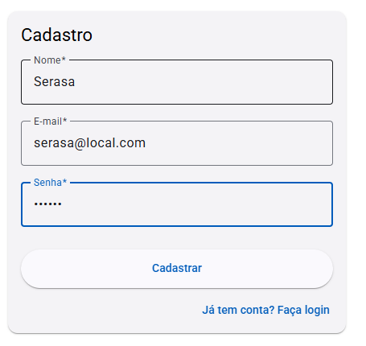
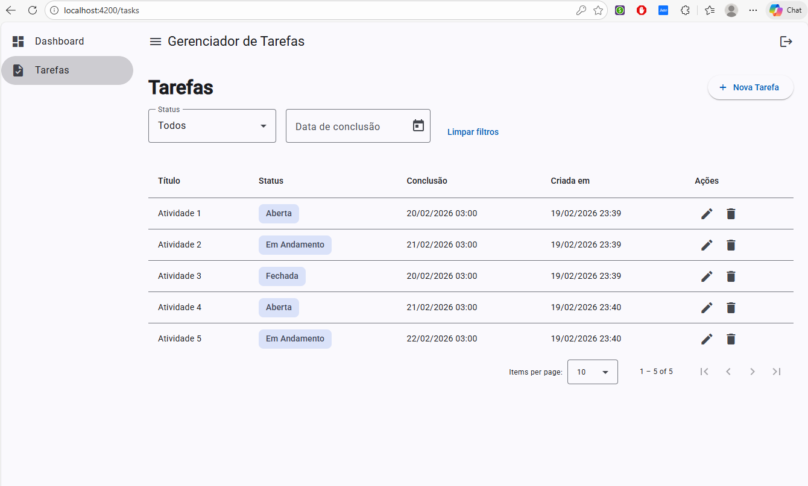
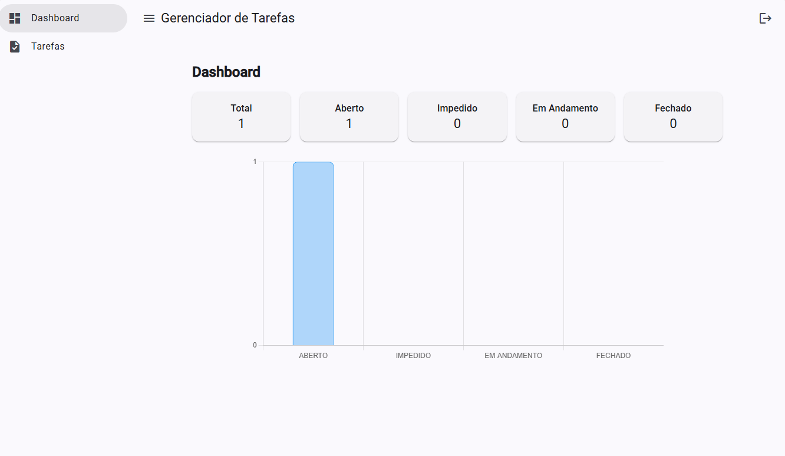
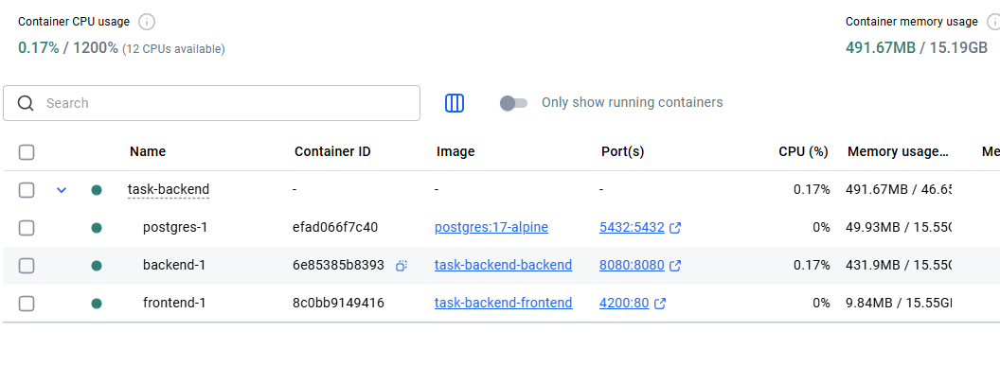

### Documentação — Frontend + Backend + Banco de dados - Task Manager

### Ferramentas utilizadas

#### Backend (API)
- **Java (runtime)**: `eclipse-temurin:21-jre` (Java 21)
- **Maven (build)**: `maven:3.9-eclipse-temurin-21`
- **Spring Boot**: `4.0.2`
- **Liquibase**: para migrations.
- 
#### Banco de dados
- **PostgreSQL**: `postgres:17-alpine`

#### Frontend (Web)
- **Angular**: `19.2.18`
- **Node.js (build)**: `node:20-alpine`
- **Nginx (runtime)**: `nginx:1.27-alpine`
    - Config SPA

### Como executar com Docker Compose

#### 1) Subir tudo (build + run)
No terminal, entre na pasta do backend:
```bash
cd task-backend
```
Depois rode:
```bash
docker compose up -d --build
```

#### 3) Acessos
- **Frontend (Angular)**: `http://localhost:4200`
- **Backend (API Spring Boot)**: `http://localhost:8080`
- **Postgres**: `localhost:5432`
    - database: `taskdb`
    - user: `admin`
    - password: `admin`

#### 4) Parar o stack
Na pasta `task-backend`:
```bash
docker compose down
```

### Seed do usuário admin (quando a aplicação sobe)

Seed acontece automaticamente basta subir a aplicação via docker compose.

Credenciais padrão do seed:
- email: `admin@local.com`
- senha: `admin`

### Dicas rápidas de verificação

- FRONTEND:
- abrir `http://localhost:4200`

- BACKEND:
- abrir `http://localhost:8080`

- **Tela Login**


- **Tela Cadastro**



- **Tela Tarefas**



- **Tela Cadastro de Tarefas**


- **Dashboard Admin**


- **Dashboard Usuario**



- **Docker**

